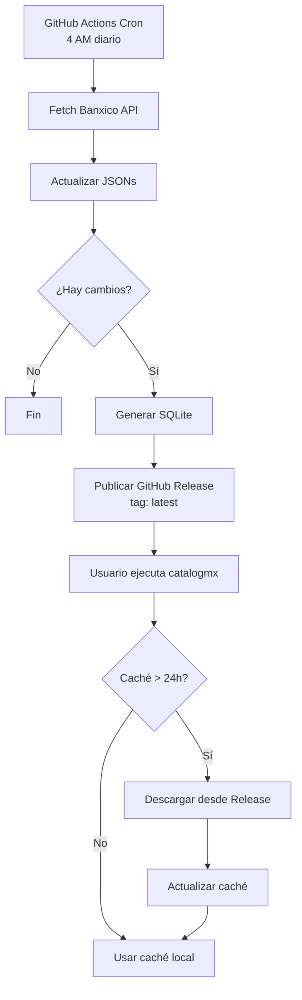

# 🚀 Guía de Implementación: Sistema de Actualización SQLite

## ✅ Estado Actual

Se ha implementado la **Fase 1** del sistema de desacoplamiento de datos:

### Archivos Creados

```
✅ packages/shared-data/schema_dynamic.sql
   - Schema completo para datos dinámicos de Banxico
   - Tablas: udis, tipo_cambio, tiie, cetes, inflacion, salarios_minimos
   - Views, triggers e índices optimizados

✅ packages/shared-data/scripts/json_to_sqlite_dynamic.py
   - Script de migración JSON → SQLite
   - Maneja ~50,000 registros
   - Genera mexico_dynamic.sqlite3 (6.38 MB)

✅ packages/shared-data/mexico_dynamic.sqlite3
   - Base de datos generada con éxito
   - 11,199 UDIs
   - 26,743 tipos de cambio
   - 7,516 TIIE
   - 5,003 CETES
   - 184 inflación

✅ packages/python/catalogmx/data/updater.py
   - Sistema de auto-actualización
   - Descarga desde GitHub Releases
   - Caché local + fallback a datos empaquetados
   - Variables de entorno configurables

✅ packages/python/catalogmx/data/mexico_dynamic.sqlite3
   - Copia empaquetada como fallback
   - Se incluirá en distribución pip/PyPI

✅ packages/python/catalogmx/catalogs/banxico/udis_sqlite.py
   - UDICatalog migrado a SQLite
   - API 100% compatible con versión JSON
   - Tests verificados ✓

✅ .github/workflows/update-dynamic-data.yml
   - Workflow diario de actualización
   - Publica en GitHub Releases (tag 'latest')
   - No crea releases de código

✅ docs/SQLITE-UPDATE-DECOUPLING.md
   - Documento completo de diseño
   - Arquitectura, beneficios, plan de implementación
```

## 📋 Pasos Siguientes

### Fase 1: Completar Migración de Catálogos Banxico

**Tareas pendientes:**

1. **Migrar TipoCambioUSDCatalog a SQLite** ⏳
   ```bash
   # Crear packages/python/catalogmx/catalogs/banxico/tipo_cambio_usd_sqlite.py
   # Basado en udis_sqlite.py
   ```

2. **Migrar otros catálogos Banxico** (opcional)
   - TIIE
   - CETES
   - Inflación
   - Salarios mínimos

### Fase 2: Testing Completo

**2.1. Tests Unitarios**
```bash
cd packages/python

# Crear tests/test_data_updater.py
# - Test get_database_path()
# - Test auto_update()
# - Test fallback a embedded
# - Test manejo de errores

# Crear tests/test_udis_sqlite.py
# - Comparar resultados con udis.py original
# - Verificar que todas las funciones funcionan
# - Test de conversiones pesos/UDIs
```

**2.2. Tests de Integración**
```bash
# Simular descarga desde GitHub Releases (mock)
# Verificar que caché local funciona
# Test de actualización automática
```

### Fase 3: Activar Nuevo Sistema

**3.1. Actualizar imports en `__init__.py`**
```python
# En packages/python/catalogmx/catalogs/banxico/__init__.py

# ANTES:
from .udis import UDICatalog, get_udi_actual

# DESPUÉS:
from .udis_sqlite import UDICatalog, get_udi_actual
```

**3.2. Deprecar versiones antiguas**
```python
# Mantener udis.py por retrocompatibilidad
# Agregar warning de deprecación
import warnings

warnings.warn(
    "udis.py será removido en v2.0. Los datos ahora se actualizan automáticamente.",
    DeprecationWarning,
    stacklevel=2
)
```

### Fase 4: Primera Publicación de Datos

**4.1. Ejecutar workflow manualmente**
```bash
# En GitHub:
# Actions → "Update Dynamic Data" → Run workflow
```

**4.2. Verificar Release**
```bash
# Debe crear:
# - Release "latest" con mexico_dynamic.sqlite3
# - Release "data-YYYY-MM-DD" archivado
```

**4.3. Probar descarga**
```python
from catalogmx.data import DataUpdater

updater = DataUpdater()
updater.download_latest(verbose=True)
# Debe descargar de GitHub Releases
```

### Fase 5: Documentación Usuario

**5.1. Actualizar README.md**
```markdown
## 🔄 Actualización Automática de Datos

catalogmx ahora actualiza automáticamente datos de Banxico sin necesidad de reinstalar:

- **UDIs**: Actualizados diariamente
- **Tipo de Cambio**: Actualizados diariamente
- **TIIE/CETES**: Actualizados diariamente

### Configuración

\`\`\`python
# Deshabilitar auto-actualización (datos empaquetados)
import os
os.environ['CATALOGMX_AUTO_UPDATE'] = 'false'

# Cambiar directorio de caché
os.environ['CATALOGMX_CACHE_DIR'] = '/custom/path'
\`\`\`
```

**5.2. Crear guía de migración**
```markdown
# docs/guides/MIGRATION-TO-SQLITE.md
# Para usuarios que ya usan catalogmx
```

## 🧪 Cómo Probar Ahora

### Test 1: Verificar Base de Datos

```bash
cd packages/shared-data

python -c "
import sqlite3
db = sqlite3.connect('mexico_dynamic.sqlite3')
db.row_factory = sqlite3.Row

# UDI actual
cursor = db.execute('SELECT * FROM v_udi_actual')
print('UDI Actual:', cursor.fetchone()['valor'])

# Tipo cambio actual
cursor = db.execute('SELECT * FROM v_tipo_cambio_actual')
print('USD/MXN:', cursor.fetchone()['tipo_cambio'])

db.close()
"
```

### Test 2: Verificar DataUpdater

```bash
cd packages/python

python -c "
import sys
sys.path.insert(0, '.')
from catalogmx.data.updater import DataUpdater

updater = DataUpdater()
print('Version local:', updater.get_local_version())
print('Age (hours):', updater.get_local_age_hours())
print('Database path:', updater.get_database_path(auto_update=False))
"
```

### Test 3: Verificar UDICatalog

```bash
cd packages/python

# Nota: Requiere instalar dependencias (unidecode)
pip install unidecode

python -c "
from catalogmx.catalogs.banxico.udis_sqlite import get_udi_actual

udi = get_udi_actual()
print(f'UDI {udi[\"fecha\"]}: {udi[\"valor\"]}')
"
```

## 📦 Preparar para Distribución

### Incluir SQLite en package

**Actualizar `pyproject.toml`:**
```toml
[tool.poetry]
# ...

[tool.poetry.include]
# Incluir base de datos empaquetada
{ path = "catalogmx/data/mexico_dynamic.sqlite3", format = "wheel" }
```

**O en setup alternativo:**
```python
# pyproject.toml
[tool.setuptools.package-data]
catalogmx = ["data/*.sqlite3"]
```

### Verificar empaquetado

```bash
cd packages/python

# Build
python -m build

# Verificar que SQLite está incluido
unzip -l dist/catalogmx-*.whl | grep sqlite

# Debe mostrar:
# catalogmx/data/mexico_dynamic.sqlite3
```

## 🔄 Flujo Completo de Actualización



## ✅ Checklist Pre-Release

Antes de hacer release de la nueva versión de catalogmx:

- [ ] Migrar todos los catálogos Banxico a SQLite
- [ ] Tests unitarios completos (90%+ coverage)
- [ ] Tests de integración end-to-end
- [ ] Documentación actualizada (README, CHANGELOG)
- [ ] Verificar que SQLite se incluye en wheel
- [ ] Ejecutar workflow y crear primer release de datos
- [ ] Probar descarga automática funciona
- [ ] Actualizar ejemplos en documentación
- [ ] Versión semántica (1.x.0 → 2.0.0 por breaking changes?)

## 🐛 Troubleshooting

### "FileNotFoundError: No database available"

**Causa**: No hay caché local y auto-update está deshabilitado

**Solución**:
```python
# Opción 1: Habilitar auto-update
os.environ['CATALOGMX_AUTO_UPDATE'] = 'true'

# Opción 2: Descargar manualmente
from catalogmx.data import update_now
update_now()
```

### "Database is locked"

**Causa**: Múltiples procesos accediendo SQLite

**Solución**:
```python
# SQLite usa conexiones de lectura concurrente
# Solo escrituras necesitan lock
# Para catalogmx (solo lectura) no debería ocurrir
```

### Datos desactualizados

**Verificar**:
```python
from catalogmx.data import get_version
print(get_version())  # Debe mostrar fecha reciente
```

**Forzar actualización**:
```python
from catalogmx.data import update_now
update_now(force=True)
```

## 📚 Referencias

- [Diseño completo](./SQLITE-UPDATE-DECOUPLING.md)
- [Schema SQL](../packages/shared-data/schema_dynamic.sql)
- [Script migración](../packages/shared-data/scripts/json_to_sqlite_dynamic.py)
- [Workflow GitHub](../.github/workflows/update-dynamic-data.yml)

---

**Última actualización**: 2025-12-04
**Estado**: ✅ Fase 1 Completada - Listo para testing
