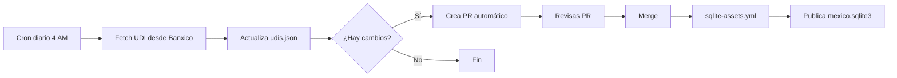

# Actualización Automática de UDIs desde Banxico

## 🔧 Configuración (Una sola vez)

### 1. Obtener Token de Banxico

1. Ve a: https://www.banxico.org.mx/SieAPIRest/service/v1/token
2. Llena el formulario con tu email
3. Recibirás un token por correo (ejemplo: `abc123def456...`)

### 2. Agregar Token a GitHub Secrets

1. Ve a: `Settings` → `Secrets and variables` → `Actions`
2. Click en `New repository secret`
3. Nombre: `BANXICO_TOKEN`
4. Valor: Tu token de Banxico
5. Click en `Add secret`

## 🤖 Actualización Automática

Una vez configurado el token, el workflow `.github/workflows/update-udi.yml` se ejecuta:

- ✅ **Diariamente** a las 4 AM (hora de México)
- ✅ **Manualmente** desde GitHub Actions → "Update UDI Data" → "Run workflow"

### Qué hace el workflow:

1. Descarga todos los valores de UDI desde 1995-04-04 hasta hoy
2. Actualiza `packages/shared-data/banxico/udis.json`
3. Crea un Pull Request automático si hay cambios
4. Tu revisas y apruebas el PR

## 🛠️ Actualización Manual (Local)

```bash
cd catalogmx/packages/shared-data

# Opción 1: Con variable de entorno
export BANXICO_TOKEN="tu_token_aqui"
python scripts/fetch_udis_banxico.py

# Opción 2: Pasando el token directamente
python scripts/fetch_udis_banxico.py --token tu_token_aqui

# Verificar
jq '. | length' banxico/udis.json  # Debe mostrar ~11,000 registros
jq '.[-1]' banxico/udis.json        # Último registro
```

## 📊 Datos de UDI

**Serie:** SF43718  
**Periodicidad:** Diaria  
**Inicio:** 4 de abril de 1995  
**Registros esperados:** ~11,000 (30 años × 365 días)

### Estructura de datos:

```json
{
  "fecha": "2025-01-31",
  "valor": 8.412365,
  "moneda": "MXN",
  "tipo": "oficial_banxico",
  "año": 2025,
  "mes": 1,
  "notas": "Valor oficial publicado por Banco de México"
}
```

## 🔄 Flujo Completo



## ⚠️ Importante

- El token es **gratuito** y no tiene límites para uso personal
- La API de Banxico es **oficial** y siempre actualizada
- Los datos se actualizan **después de las 9 AM** hora México
- El workflow crea **PRs**, no commitea directo (para que revises)

## 🧪 Probar Localmente

```bash
# Sin commitear, solo ver los datos
cd packages/shared-data
python scripts/fetch_udis_banxico.py --token TU_TOKEN > /tmp/udis_test.json
jq '. | length' /tmp/udis_test.json
jq '.[-5:]' /tmp/udis_test.json  # Ver últimos 5 valores
```

## 📝 Siguientes Pasos

1. ✅ Obtén tu token de Banxico
2. ✅ Agrégalo a GitHub Secrets como `BANXICO_TOKEN`
3. ✅ Ejecuta manualmente el workflow para probar
4. ✅ Revisa y aprueba el PR que se crea
5. 🎉 A partir de ahí, se actualiza solo cada día

